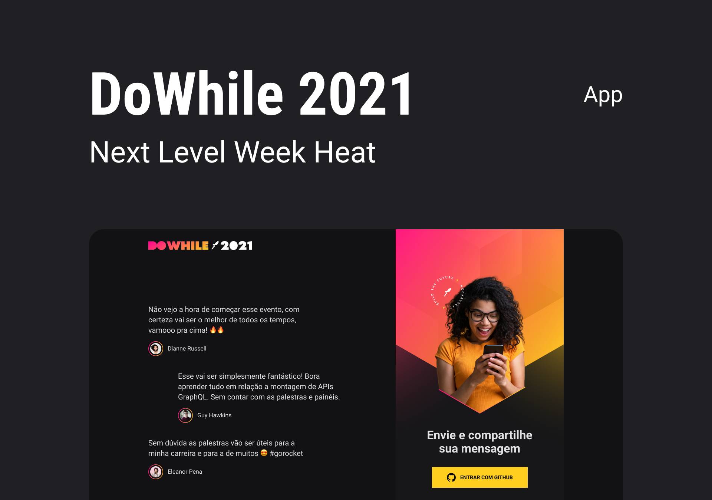

<h1 align="center">
    
</h1>
<!-- <h4 align="center">NLW Heat </h4> -->

  
  
    
  
  
  

  

   

  <a href="#-nlw">NLW</a>&nbsp;&nbsp;&nbsp;|&nbsp;&nbsp;&nbsp;
  <a href="#-project">Project</a>&nbsp;&nbsp;&nbsp;|&nbsp;&nbsp;&nbsp;
  <a href="#rocket-Technologies">Technologies</a>&nbsp;&nbsp;&nbsp;|&nbsp;&nbsp;&nbsp;
  <a href="#-layout">Layout</a>&nbsp;&nbsp;&nbsp;|&nbsp;&nbsp;&nbsp;
  <a href="#-how-to-use">How to use</a>&nbsp;&nbsp;&nbsp;|&nbsp;&nbsp;&nbsp;
  <a href="#-how-to-contribute">How to contribute</a>&nbsp;&nbsp;&nbsp;|&nbsp;&nbsp;&nbsp;
  <a href="#memo-license">License</a>

  

## :coffee: What's Next Level Week?
NLW is a practical week with lots of code, challenges, networking and a single objective: to take you to the next level.
Through our method you will learn new tools, learn about new technologies and discover hacks that will boost your career.
An online and completely free event that will help you take the next step in your evolution as a dev.

 

##  :computer: Project
The project allows people to write messages saying what their expectations are for Do While

 

## :rocket: Technologies
This project was developed with the following technologies:
- Node.js
- TypeScript
- React
- React Native
- Elixir

 

## 🔖 Layout
To access the layout use [Figma](https://www.figma.com/file/GfMrGymDY9fU1CFfig9lJy/%5BNLW-Heat---Mission%3A-Impulse%5D-DoWhile2021-(Community)?node-id=0%3A1).

 

##  ⚙️ How To Run
Follow the steps below to run this project
- Clone o repository
- Use `yarn` to install all dependencies
- Change environments variables
- Start the dev server with `yarn dev`

 

## 🤔 How to contribute
-  Make a fork;
-  Create a branch with your feature: `git checkout -b my-feature`;
-  Commit changes: `git commit -m 'feat: My new feature'`;
-  Make a push to your branch: `git push origin my-feature`.
After merging your receipt request to done, you can delete a branch from yours.

 

## :memo: License
This project is under the MIT license. See the [LICENSE](https://github.com/DanielObara/NLW-1.0/blob/master/LICENSE) for details.

Made with ♥ by [Jefferson Calmon](https://jeffersoncalmon.dev)