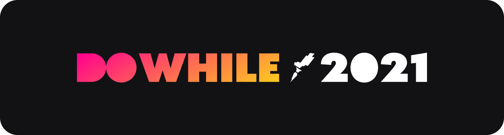

<h1 align="center">
    
</h1>
<h2 align="center"> 
    :heavy_check_mark: NLW Heat
</h2>

  
  
    
  
  
  

  

   

<!-- 

  <a href="#-nlw">Next Level Week</a>&nbsp;&nbsp;&nbsp;|&nbsp;&nbsp;&nbsp;
  <a href="#-project">Project</a>&nbsp;&nbsp;&nbsp;|&nbsp;&nbsp;&nbsp;
  <a href="#rocket-Technologies">Technologies</a>&nbsp;&nbsp;&nbsp;|&nbsp;&nbsp;&nbsp;
  <a href="#-layout">Layout</a>&nbsp;&nbsp;&nbsp;|&nbsp;&nbsp;&nbsp;
  <a href="#-how-to-use">How to use</a>&nbsp;&nbsp;&nbsp;|&nbsp;&nbsp;&nbsp;
  <a href="#-how-to-contribute">How to contribute</a>&nbsp;&nbsp;&nbsp;|&nbsp;&nbsp;&nbsp;
  <a href="#memo-license">License</a>

## :information_source: What's Next Level Week?
NLW is a practical week with lots of code, challenges, networking and a single objective: to take you to the next level.
Through our method you will learn new tools, learn about new technologies and discover hacks that will boost your career.
An online and completely free event that will help you take the next step in your evolution as a dev. -->
